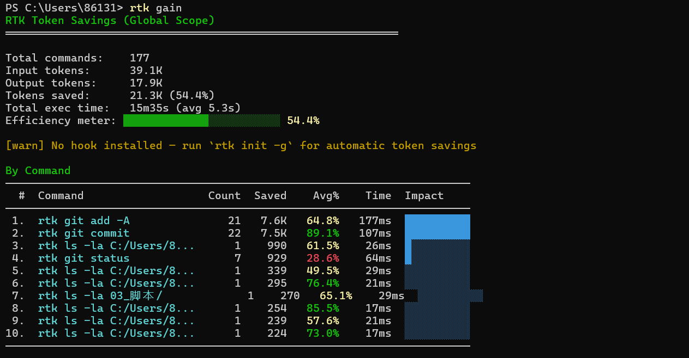
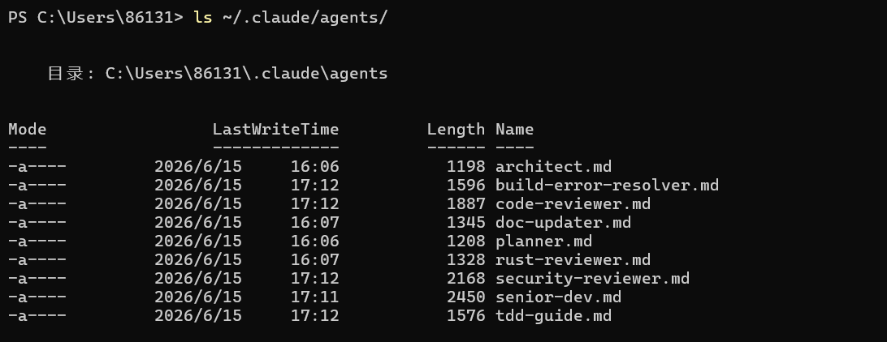

# Claude Code 开箱即用配置：DeepSeek + Windows 完整方案

> 15 分钟从零到顺手使用。每个功能都对应一个踩过的坑。

[](LICENSE)
[](#)
[](#)
[](#)

[English](README_EN.md) · [详细设置](SETUP.md)

---

## 解决什么问题

### 😵 "从零配 Claude Code 太折腾了"

MCP 一个个找、权限弹窗点到手软、子 Agent 模型不对输出质量差……这套配置把验证过的都整理好了。**克隆 → 复制 → 改两个路径 → 能用。**

### 🔥 "DeepSeek 怎么配？缓存命中率好低？"

默认配置下 DeepSeek 缓存命中率只有 ~50%，因为 Claude Code 每次请求注入的 `ATTRIBUTION_HEADER` 含会话 ID 和时间戳，缓存系统把这些变动字段当作不同请求。

→ 设 `CLAUDE_CODE_ATTRIBUTION_HEADER="0"` 关闭后命中率提升到 **90%+**，每次请求省一半 token。

### 💀 "AI 改代码改坏了，回不去"

→ 3 层自动备份，无需手动操作：

| 层 | 机制 | 触发时机 |
|----|------|---------|
| 文件级 | 每次 Edit/Write 前自动复制原文件到 `.claude/backups/`，保留最近 5 份 | PreToolUse Hook |
| Session 级 | 启动时自动 `git commit` 所有未提交变更 | SessionStart Hook |
| 手动 | `git reset --hard HEAD~1` 一键回到上一个快照 | 任何时候 |

### 🔒 "push 公开仓库怕漏密钥和路径"

→ `/desensitize` 命令 + `desensitize.py` 脚本，一键扫描：

- 🔴 CRITICAL: GitHub Token、AWS Key、API Key 等真实密钥
- 🟠 HIGH: 个人路径 (`C:\Users\xxx`)、硬编码密码
- 🟡 MEDIUM: 内网 IP、数据库连接串
- ⚪ LOW: 邮箱、HTTP 明文链接

4 个级别分类输出，每个匹配附带文件路径、行号和上下文。支持白名单（`.desensitize-allow`）排除误报。

### 🤖 "子 Agent 输出质量差，感觉不太聪明"

默认子 Agent 用 flash 模型，复杂逻辑产出低下。

→ 设 `CLAUDE_CODE_SUBAGENT_MODEL=deepseek-v4-pro`，所有子 Agent 强制用主力模型，代码审查、安全分析质量明显提升。

### 👀 "上下文什么时候满？心里没数"

→ 状态行实时显示：项目名、上下文用量进度条、当前模型、会话累计费用。

```
claude-code-starter ▇▇▇▇▇▇▇▇▇▇ ● 35% | deepseek-v4-pro ¥0.018
```
颜色随用量变化：🟢 <40% | 🟡 40-60% | 🔴 >60%。费用按 DeepSeek 实际定价 + 缓存命中率实时计算。

### 🐢 "命令太长太多，token 都浪费在命令行上了"

→ RTK (Rust Token Killer) 自动精简所有 shell 命令输出，实测节省 **55%** token。`git status` → 只返回关键信息，不带冗余废话。

### 🪟 "Windows 下路径格式、Python 环境各种坑"

→ 所有 MCP 路径已用双反斜杠格式，Python 脚本路径已配置好。QGIS 自带 Python DLL 冲突也有解决方案。

### ⛓️ "多个检查要排队等，浪费时间"

→ 代码审查、安全检查、多引擎搜索……独立任务并行执行，不用一个个等。

---

## 里面有什么

| 类别 | 数量 | 内容 |
|------|:--:|------|
| MCP 服务 | 8 | 文件操作 · 浏览器自动化 · GitHub · PostgreSQL · Context7 · DuckDuckGo · Parallel Search · Squish |
| 自定义 Agent | 9 | 代码审查 · 安全检查 · TDD 向导 · 架构设计 · 构建排错 · 代码简化 · 文档更新 · Rust 审查 · 高级实现 |
| 规则文件 | 6 | 代码质量 · 安全 · 测试 · 工作流 · 性能 · 设计模式 |
| 自研脚本 | 6 | 自动备份 · Session 快照 · 脱敏扫描 · 配置健康检查 · EasyOCR · 状态行 |
| 快捷命令 | 4 | `/desensitize` 脱敏审查 · `/status` 配置检查 · `/ocr` 截图识别 · `/backup` 手动快照 |

---

## 📸 截图

| RTK 令牌节省 (55%) | 自定义 Agent (9) |
|:---:|:---:|
|  |  |

---

## 快速开始

```bash
# 1. 注册 DeepSeek 获取 API Key → https://platform.deepseek.com
# 2. 克隆仓库
git clone https://github.com/YuhaoLin2005/claude-code-starter.git
cd claude-code-starter

# 3. 复制配置
cp -r .claude/* ~/.claude/
cp templates/mcp.json.example ~/.mcp.json

# 4. 编辑 ~/.mcp.json，把文件路径改成你自己的

# 5. 设置环境变量
#    Windows: setx ANTHROPIC_API_KEY "sk-your-deepseek-key"
#    Mac/Linux: export ANTHROPIC_API_KEY="sk-your-deepseek-key"

# 6. 重启 Claude Code
```

📖 **[详细设置指南（含每个步骤的注意事项和截图）](SETUP.md)** 

---

## 踩坑笔记

折腾过程中踩过的坑，可能会帮你省一些时间：

- **子 Agent 输出质量差**：默认用了 flash 模型，设 `CLAUDE_CODE_SUBAGENT_MODEL=deepseek-v4-pro` 后正常
- **缓存命中率低（原理）**：ATTRIBUTION_HEADER 含会话 ID/时间戳变量，设 `"0"` 关闭后命中率 50%→90%+
- **长文本上下文利用**：设置 `autoCompactWindow=600K` + `CLAUDE_CODE_MAX_OUTPUT_TOKENS=32000` + `alwaysThinkingEnabled=true`
- **Windows MCP 路径**：filesystem 服务器的路径要写双反斜杠 `C:\\Users\\...`
- **RTK 安装注意**：crates.io 上有重名包 (Rust Type Kit)，别装错了
- **图片识别方案**：改用 EasyOCR 本地识别（离线、免 API Key），脚本：`.claude/scripts/ocr.py`
- **PyTorch GPU**：QGIS 自带 Python 的 DLL 会冲突，装独立 Python 解决

---

## 关于作者

大三在读，PM 方向，AI + 代码结合是最感兴趣的方向。这个仓库是折腾副产品，觉得有用的整理出来了。

---

## 致谢

站在很多开源项目和社区贡献者的肩膀上。完整列表见 [ATTRIBUTIONS.md](ATTRIBUTIONS.md)。

## 许可证

MIT
